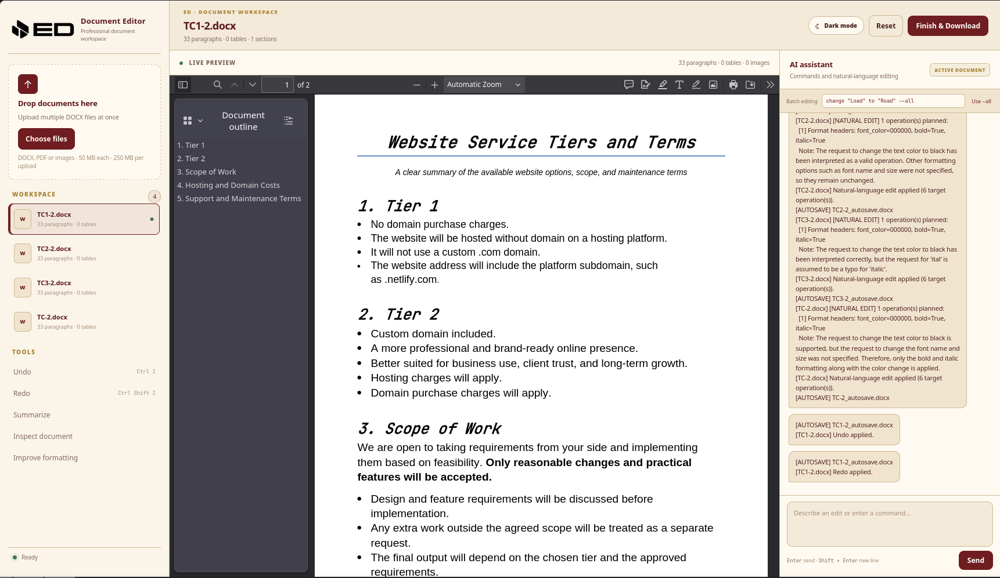
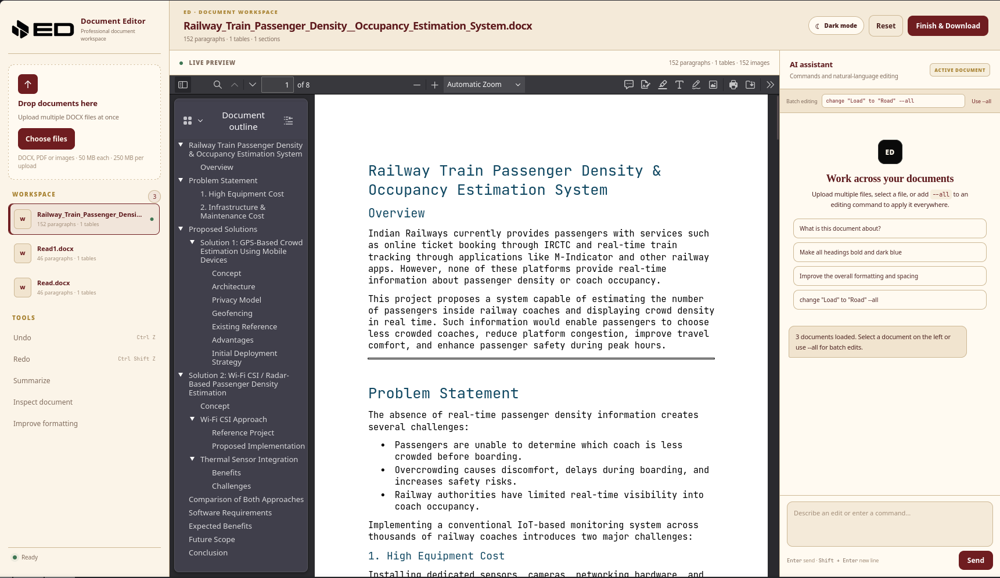
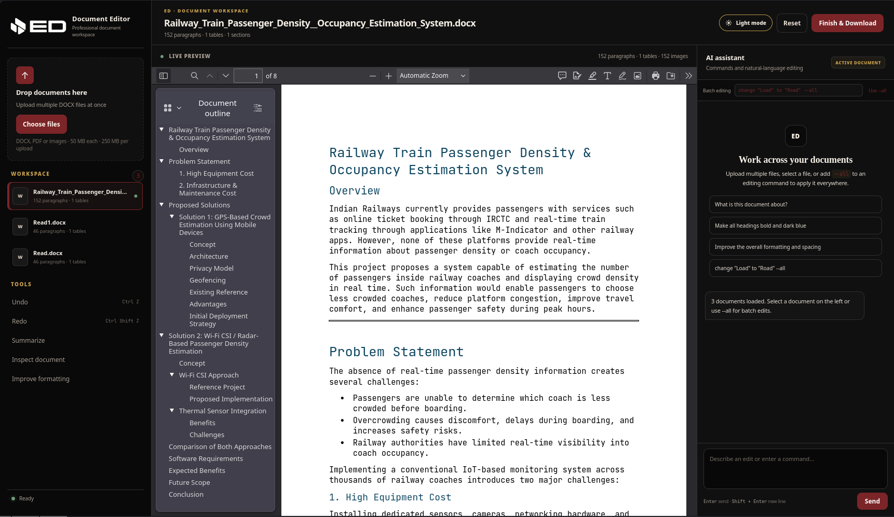

<p align="center">
  
</p>

<p align="center">
  <strong>AI-powered document workspace for editing, reviewing, and batch-processing DOCX files.</strong>
</p>

<p align="center">
  <a href="https://github.com/Turbo-N11/ED-AI-Document-Editor-">GitHub Repository</a>
</p>

<p align="center">
  <a href="#features">Features</a> •
  <a href="#quick-start">Quick Start</a> •
  <a href="#commands">Commands</a> •
  <a href="#architecture">Architecture</a> •
  <a href="#development">Development</a>
</p>

<p align="center">
  
</p>

# ED — AI Document Editor

ED is a self-hosted web application for working with Microsoft Word documents in a focused document workspace. It combines a Flask backend, a DOCX editing engine, LibreOffice-powered document previews, and optional AI-assisted editing.

The goal is simple: **load your documents, work on the one you need, or apply a supported command across the entire workspace with `--all`.**

## Features

### Document workspace

- Upload multiple files in one session.
- Drag and drop documents into the workspace.
- Select an active document without re-uploading it.
- Keep several DOCX files available at the same time.
- Show document metadata and workspace status.
- Export a single document or download the loaded workspace as a ZIP.

### DOCX editing

- Direct text replacement in document body content.
- Replacement inside tables.
- Replacement inside headers.
- Replacement inside footers.
- AI-assisted natural-language editing when an AI provider is configured.
- Document inspection and summarization tools.

### Batch editing

A normal command operates on the active document:

```text
change "Load" to "Road"
```

Add `--all` when the same operation should be applied to every loaded document:

```text
change "Load" to "Road" --all
```

`--all` can also appear at the beginning:

```text
--all change "Load" to "Road"
```

This makes the scope explicit instead of silently modifying every document.

### Preview

ED uses LibreOffice to generate a PDF preview of the current DOCX document. The preview is displayed through the browser's native PDF viewer, preserving LibreOffice's document rendering and familiar page/zoom controls.

### UI

- Professional light theme.
- Professional near-black dark theme.
- Burgundy and muted-gold accent system.
- Theme toggle with persisted preference.
- ED branding and favicon.
- Responsive workspace layout.

## Screenshots

<p align="center">
  
</p>

<p align="center">
  
</p>

<p align="center">
  
</p>


## Quick Start

### 1. Clone the repository

```bash
git clone https://github.com/Turbo-N11/ED-AI-Document-Editor-.git
cd ED-AI-Document-Editor-
```

### 2. Create a virtual environment

Linux/macOS:

```bash
python -m venv .venv
source .venv/bin/activate
```

Windows PowerShell:

```powershell
python -m venv .venv
.venv\Scripts\Activate.ps1
```

### 3. Install Python dependencies

```bash
pip install -r requirements.txt
```

### 4. Install LibreOffice

LibreOffice is required for the DOCX preview/conversion pipeline.

On Arch Linux:

```bash
sudo pacman -S libreoffice-fresh
```

On Debian/Ubuntu:

```bash
sudo apt install libreoffice
```

Verify that it is available:

```bash
libreoffice --version
```

### 5. Configure AI access

ED can use an OpenRouter API key for AI-assisted operations.

Set it in your shell:

```bash
export OPENROUTER_API_KEY="your-api-key"
```

Or create a local `.env`/environment configuration appropriate for your deployment. **Never commit API keys to Git.**

### 6. Start ED

```bash
python app.py
```

Open:

```text
http://127.0.0.1:5000
```

## Commands

| Command | Scope | Purpose |
|---|---|---|
| `change "A" to "B"` | Active document | Replace text |
| `change "A" to "B" --all` | All loaded documents | Batch replacement |
| `--all change "A" to "B"` | All loaded documents | Batch replacement with prefix syntax |
| `replace "A" with "B" --all` | All loaded documents | Alternative replacement syntax |
| `summarize` | Active document | Generate a document summary |
| `inspect document` | Active document | Inspect document content/structure |
| `improve formatting` | Active document | Request formatting improvements |

The command parser is intentionally conservative about document scope. If a command does not contain `--all`, it should operate on the active document rather than the entire workspace.

## Multiple-document workflow

A typical batch workflow looks like this:

```text
1. Upload January.docx
2. Upload February.docx
3. Upload March.docx
4. Select January.docx to inspect it
5. Enter: change "Load" to "Road" --all
6. ED applies the supported replacement to every loaded document
7. Download the resulting documents
```

This is useful for recurring document sets, templates, monthly reports, agreements, notices, and other document collections that require consistent text changes.

## Project Structure

```text
ED/
├── app.py
├── document_editor_core.py
├── requirements.txt
├── README.md
├── .gitignore
├── templates/
│   └── index.html
├── static/
│   ├── app.js
│   ├── app.css
│   └── assets/
│       ├── ed-logo-icon.png
│       └── ed-logo-horizontal.png
└── assets/
    ├── ed-banner.png
    └── ed-ui-preview.png
```

> `assets/` contains repository documentation media. `static/assets/` contains assets served directly by the Flask application.

## Architecture

```text
┌──────────────────────────────────────────────┐
│                    Browser                   │
│                                              │
│  Workspace  ──  Document Preview  ──  AI UI │
└──────────────────────┬───────────────────────┘
                       │ HTTP / JSON
                       ▼
┌──────────────────────────────────────────────┐
│                  Flask app                   │
│                    app.py                    │
│                                              │
│  Uploads • Sessions • Commands • Preview    │
│  Downloads • AI requests • Workspace state  │
└───────────────┬──────────────────┬───────────┘
                │                  │
                ▼                  ▼
┌────────────────────────┐   ┌─────────────────┐
│ document_editor_core.py │   │ AI provider     │
│                        │   │ OpenRouter      │
│ DOCX manipulation      │   │                 │
│ body / tables /        │   │ Natural-language │
│ headers / footers      │   │ operations      │
└────────────┬───────────┘   └─────────────────┘
             │
             ▼
      ┌───────────────┐
      │  LibreOffice  │
      │ DOCX → PDF    │
      └───────┬───────┘
              ▼
       Browser PDF viewer
```

## Requirements

- Python 3.10+
- Flask
- `python-docx`
- LibreOffice
- Pillow
- Internet access for OpenRouter AI features
- A modern browser such as Firefox, Chromium, or Chrome

See `requirements.txt` for the Python dependency versions used by the project.

## Configuration

The most important runtime configuration is the AI API key:

```bash
export OPENROUTER_API_KEY="your-api-key"
```

Keep secrets outside the repository. A good Git workflow is:

```text
.env              ← local secrets, never commit
.env.example      ← safe variable names/placeholders, commit
.gitignore        ← ignore .env and generated files
```

## Security Notes

ED processes user-uploaded documents, so deployment security matters.

Before exposing an instance publicly, consider:

- Keep API keys server-side only.
- Validate uploaded filenames and extensions.
- Enforce upload-size limits.
- Use isolated temporary/session directories.
- Clean up old uploaded files.
- Do not expose arbitrary filesystem paths through commands.
- Run behind a production WSGI server and HTTPS in production.
- Add authentication before deploying ED as a multi-user service.

## Development

Run the application locally:

```bash
source .venv/bin/activate
python app.py
```

When changing frontend files, a hard browser refresh can help clear cached assets:

```text
Ctrl + Shift + R
```

For backend changes, restart the Flask process.

## Testing Checklist

Before publishing a release, verify:

- [ ] A single DOCX can be uploaded.
- [ ] Multiple DOCX files can be uploaded.
- [ ] Documents can be switched from the workspace list.
- [ ] The LibreOffice preview opens correctly.
- [ ] Body text replacement works.
- [ ] Table replacement works.
- [ ] Header replacement works.
- [ ] Footer replacement works.
- [ ] A normal command only affects the active document.
- [ ] `--all` affects every loaded document.
- [ ] Download works for one document.
- [ ] ZIP download works for multiple documents.
- [ ] AI features fail gracefully when no API key is configured.
- [ ] Invalid or oversized uploads produce useful errors.
- [ ] Light/dark theme switching works.

## Known Limitations

- The editing engine is primarily DOCX-focused.
- PDF and image uploads are treated as auxiliary session files rather than fully editable Word documents.
- LibreOffice must be installed on the machine running ED for document preview/conversion.
- AI editing requires a configured provider/API key.
- The included Flask development server is intended for local development, not production deployment.

## Roadmap

Potential future improvements include:

- Per-document undo/redo history.
- Safer batch-operation confirmation dialogs.
- A dedicated command palette.
- More advanced DOCX formatting operations.
- Additional AI providers, including local models.
- Authentication and multi-user workspaces.
- Background document processing.
- Automated tests and CI.
- Docker-based deployment with LibreOffice included.

## Contributing

Contributions are welcome.

A good contribution workflow is:

```bash
git checkout -b feature/my-change
# make your changes
git add .
git commit -m "Add my change"
git push origin feature/my-change
```

Then open a pull request describing:

- What changed
- Why it changed
- How it was tested
- Any limitations or follow-up work

## License

Choose and add an open-source license before publishing ED publicly. MIT and Apache-2.0 are both reasonable choices for this type of project.

## Credits

Built with:

- Python
- Flask
- python-docx
- LibreOffice
- HTML / CSS / JavaScript
- OpenRouter-compatible AI APIs

---

<p align="center">
  <strong>ED — AI Document Editor</strong><br>
  <sub>Load. Edit. Automate.</sub>
</p>
